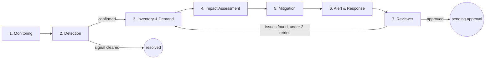
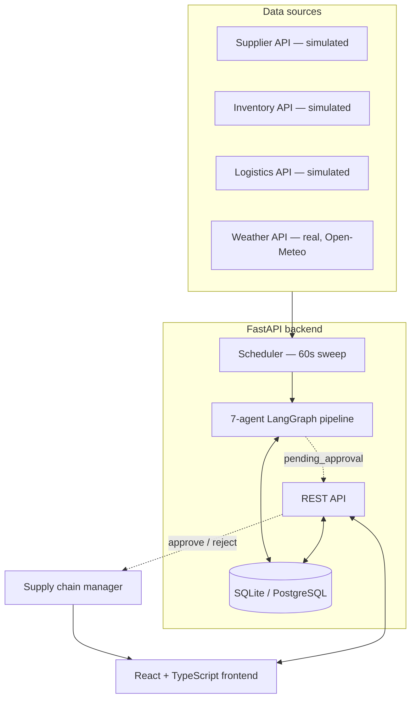
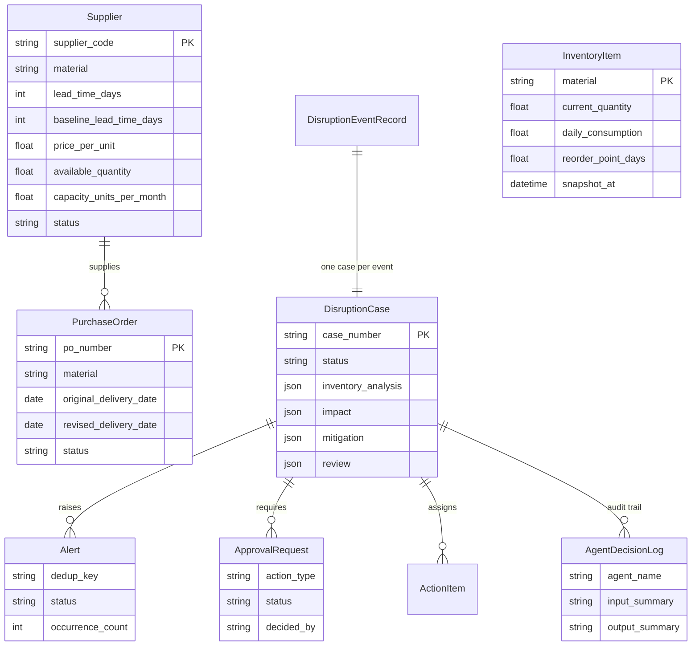

# Agentic AI Supply Chain Disruption Monitoring System

## What this is

A working system that watches a supply chain, notices when something goes wrong, and
tells a human what to do about it — before any money gets spent.

Concretely: seven specialized agents run in a pipeline (built with **LangGraph**). One
watches supplier, inventory, and logistics data for trouble. When it finds something, the
next agents confirm it's real, calculate exactly how many days of stock are left, work out
who and what gets hurt, rank the alternative suppliers that could cover the gap, raise one
deduplicated alert, and hand the whole case to a person to approve or reject. Nothing gets
purchased, and no supplier gets switched, without that human decision.

The system is built around one worked example from the project spec: a steel supplier
announces a 10-day delay. The plant has 25 tonnes on hand, burning 5 tonnes a day — 5 days
of runway. The delayed delivery lands 6 days after the plant would run dry. The system is
expected to catch that gap, find a faster alternative supplier, and flag it — all before a
person has committed to anything. That scenario is seeded into the database on first run,
along with three more disruptions covering the project's other test cases.

**Stack:** FastAPI + SQLModel + LangGraph on the backend, React + TypeScript + Tailwind on
the frontend, SQLite for zero-setup local dev (swap in Postgres with one env var for
production).

## How to use it

### 1. Run the backend

```bash
cd backend
python -m venv venv
venv\Scripts\activate
pip install -r requirements.txt
uvicorn app.main:app --reload --port 8000
```

That's it — no API keys, no database setup. On first startup it creates its tables, seeds
the demo dataset, and starts the monitoring scheduler. It runs entirely on a local SQLite
file and a template-based text generator standing in for an LLM (see
[LLM narration](#llm-narration) below for how to switch that on).

### 2. Run the frontend

```bash
cd frontend
npm install
npm run dev
```

Open `http://localhost:5173`. In dev, Vite proxies API calls to the backend on port 8000,
so both need to be running.

### 3. Try it

The sidebar's **Run monitoring sweep** button scans every data source right now instead of
waiting for the 60-second scheduler. Three of the five seeded materials (Copper Wire,
Rubber Gasket, Industrial Bearings) already have live problems and will show up as
disruptions immediately with zero manual steps.

To see the full worked example, click **Launch Disruption Simulator** and press **Inject
TC-01 disruption** — this announces the 10-day steel-plate delay from the spec, then runs
the pipeline against it. Walk through the app in this order to see the whole story (real
screenshots of exactly this walkthrough are in [`docs/demo/`](docs/demo/)):

1. **Dashboard** — the new case appears under Active Disruptions; click it to open the
   **Explainability Trace** — every agent's real input, conclusion, and cited evidence, in
   the order it ran.
2. **Impact Analysis** — see the exact coverage math (25t / 5t/day = 5 days) and the
   projected stockout date.
3. **Mitigation Planning** — see the ranked alternative suppliers (including capacity, not
   just on-hand stock), approve or reject the proposed response as the human in the loop,
   and see it labeled with exactly which of the four approval categories it is (e.g.
   *Change Supplier*).
4. **Analytics** — pandas-computed trends across every case ever recorded: frequency by
   material, severity mix, alert load by team.
5. **Reports** — download the generated PDF disruption assessment for that case.

The same modal's **Inject TC-05 restoration** button resets the delivery date, so you can
watch the case auto-resolve on the next sweep instead of staying open forever. The
Suppliers page has an equivalent pair of buttons for the sixth disruption type (**Raise
lead time** / **Restore**).

---

## Beyond the spec

Two additions that go past what was asked for:

- **Pandas-powered Analytics page** — the spec lists Pandas in the tech stack but its own
  worked example doesn't actually need it (a coverage calculation is one division). Rather
  than an unused import, [`app/services/analytics.py`](backend/app/services/analytics.py)
  uses real pandas `groupby`/aggregation over every case and alert ever recorded — frequency
  by material, severity mix, average mitigation window by severity, alert load by team, a
  14-day activity timeline, and the Reviewer's revision rate — surfaced on a new
  [Analytics page](frontend/src/pages/Analytics.tsx) with live charts.
- **Explainability Trace viewer** — the problem statement's very first list of things the
  system should demonstrate includes *"explainable recommendations."* Clicking any case now
  opens its full Context Lake: every agent's exact input, conclusion, and cited evidence, in
  the order it ran, each one expandable to the raw JSON evidence behind it - not a
  description of what the pipeline generally does, but the specific record of what it did
  for this case.

---

## Table of contents

- [Agent pipeline](#agent-pipeline)
- [System architecture](#system-architecture)
- [Data sources](#data-sources)
- [Automated monitoring](#automated-monitoring)
- [Inventory math](#inventory-math)
- [Supplier comparison](#supplier-comparison)
- [Alerts and deduplication](#alerts-and-deduplication)
- [Human approval](#human-approval)
- [LLM narration](#llm-narration)
- [Analytics](#analytics)
- [Explainability](#explainability)
- [Database schema](#database-schema)
- [API reference](#api-reference)
- [Frontend pages](#frontend-pages)
- [Testing](#testing)
- [Deployment](#deployment)

## Agent pipeline

Seven agents run as nodes in a single LangGraph `StateGraph`
([`backend/app/agents/graph.py`](backend/app/agents/graph.py)), sharing one `CaseState`
dict per disruption case as it moves through the pipeline.



| # | Agent | File | What it does |
|---|-------|------|---------------|
| 1 | Supply Chain Monitoring | [`monitoring_agent.py`](backend/app/agents/monitoring_agent.py) | Scans every source for candidate signals, then re-confirms one signal's live status right before Detection acts on it. |
| 2 | Disruption Detection | [`detection_agent.py`](backend/app/agents/detection_agent.py) | Re-checks the signal against fresh data across all six disruption types (supplier delay, shipment delay, shortage, low inventory, supplier unavailable, **and unusual lead-time increase**). If it's no longer real (e.g. the delivery date was restored, or a lead time returned to baseline), the case is marked resolved here and the pipeline stops. |
| 3 | Inventory & Demand Analysis | [`inventory_agent.py`](backend/app/agents/inventory_agent.py) | Calls the deterministic coverage/stockout math — never computes a number itself. |
| 4 | Impact Assessment | [`impact_agent.py`](backend/app/agents/impact_agent.py) | Finds the open purchase orders, production orders, and customers this actually affects, and rates severity. |
| 5 | Alternative Supplier & Mitigation | [`mitigation_agent.py`](backend/app/agents/mitigation_agent.py) | Ranks approved alternative suppliers on lead time, price, available quantity, **and ongoing capacity**; a supplier missing any of the four is labeled "requires verification," never guessed at. |
| 6 | Alert & Response Planning | [`alert_agent.py`](backend/app/agents/alert_agent.py) | Consolidates everything into one deduplicated alert, assigns action items, sends the notification. |
| 7 | Reviewer / Critic | [`reviewer_agent.py`](backend/app/agents/reviewer_agent.py) | Independently re-runs the math and checks every claim has evidence behind it; can send the case back for revision (capped at 2 retries). |

**Why LangGraph, not a plain script:** the workflow has real branches — a resolved signal
short-circuits after step 2, and the Reviewer can loop back to a specific earlier step —
which is exactly what `StateGraph`'s conditional edges are for.

**Why human approval isn't a LangGraph interrupt:** the graph runs to completion each pass
and saves the case at `status="pending_approval"`; a plain REST endpoint
(`POST /api/approvals/{id}/decision`) resumes the workflow from there. That keeps the app
deployable without a checkpointer backend, while still guaranteeing nothing gets committed
without a recorded human decision.

### Agent narration prompts

Each agent that writes a natural-language summary calls one fixed prompt against
already-computed numbers — it never invents a number of its own:

- Inventory Agent — *"Summarize the inventory coverage situation for the supply chain
  manager in one sentence."*
- Impact Agent — *"Summarize the operational impact of this disruption for a supply chain
  manager."*
- Mitigation Agent — *"Summarize the mitigation options available for this material
  shortage."*
- Alert Agent — *"Draft a concise alert notification body ... covering disruption type,
  affected material, source, expected impact, and recommended action."*

## System architecture



Exported image (for the submission's "architecture diagram" requirement, in case the
viewer doesn't render Mermaid): [`docs/diagrams/system-architecture.png`](docs/diagrams/system-architecture.png).
The [agent pipeline](docs/diagrams/agent-pipeline.png) and [database schema](docs/diagrams/database-schema.png)
are exported the same way, generated straight from the Mermaid source with
`mmdc` (`npx @mermaid-js/mermaid-cli`) so they never drift from the diagrams above.

## Data sources

| Source | Module | Real or simulated |
|---|---|---|
| Supplier status / delivery dates | [`supplier_api.py`](backend/app/integrations/supplier_api.py) | Simulated — backed by the `Supplier`/`PurchaseOrder` tables, shaped like a real API client so swapping in a live feed later touches no agent code |
| Inventory snapshot | [`inventory_api.py`](backend/app/integrations/inventory_api.py) | Simulated |
| Logistics tracking | [`logistics_api.py`](backend/app/integrations/logistics_api.py) | Simulated |
| Weather risk | [`weather_api.py`](backend/app/integrations/weather_api.py) | **Real** — [Open-Meteo](https://open-meteo.com/), no API key needed. Degrades to "unknown" on a network failure instead of crashing the pipeline. |
| Email notification | [`email_api.py`](backend/app/integrations/email_api.py) | Log-mode by default — set `EMAIL_MODE=smtp` to send for real |

## Automated monitoring

[`scheduler.py`](backend/app/scheduler.py) runs a sweep every `MONITOR_INTERVAL_SECONDS`
(default 60). Each sweep, via [`case_runner.py`](backend/app/services/case_runner.py):

1. Re-checks every open case against its live source, so a restored delivery resolves the
   case instead of staying open forever.
2. Scans for brand-new signals: delayed purchase orders, delayed shipments, materials
   below their reorder threshold, unavailable suppliers.
3. Runs each confirmed candidate through the seven-agent pipeline.

Deduplication happens at the case level: a fresh sweep re-uses the existing case for the
same `(material, disruption_type)` instead of spawning a new one, and once a human has
approved or rejected a case, later sweeps leave that decision alone.

## Inventory math

Every formula lives in [`inventory_math.py`](backend/app/tools/inventory_math.py) as a
plain, unit-tested Python function — never inside an LLM call:

```
coverage_days           = current_quantity / daily_consumption
projected_stockout_date = inventory_snapshot_date + coverage_days   (only if the snapshot date is known)
reorder_required        = coverage_days <= reorder_point_days
mitigation_window_days  = projected_stockout_date - today            (None if not calculable)

severity = critical  if mitigation_window_days < 0
         | high      if mitigation_window_days <= 3
         | medium    if mitigation_window_days <= 10
         | low       otherwise
         | unknown   if not calculable
```

Worked example: 25t / 5t/day = **5 days** coverage; snapshot 2026-09-19 → stockout
**2026-09-24**; the revised delivery (2026-09-30) lands 6 days after that, so a genuine
coverage gap is flagged.

The stockout date is never invented — if the inventory snapshot timestamp is missing, it's
left blank with a note explaining why. This is asserted directly in
[`test_inventory_math.py`](backend/tests/test_inventory_math.py).

A sixth disruption type follows the same "never invent, never crash" spirit but at the
supplier level rather than the inventory level: if a supplier's quoted lead time grows 30%+
past the `baseline_lead_time_days` on file (`LEAD_TIME_INCREASE_THRESHOLD` in `.env`), it's
flagged as an unusual lead-time increase even with no active delay yet - a leading indicator,
not just a lagging one.

## Supplier comparison

[`supplier_compare.py`](backend/app/tools/supplier_compare.py) scores every approved
alternative supplier on all four dimensions Requirement 6 names - not three:

- `data_confidence = "confirmed"` only when lead time, price, available quantity, **and
  ongoing capacity** are **all** known; otherwise `"requires_verification"` - surfaced,
  never hidden or guessed.
- `meets_quantity` and `meets_capacity` are judged **separately**: a supplier can have
  plenty on the shelf today (`available_quantity`) but not enough ongoing monthly
  production (`capacity_units_per_month`) to keep a plant supplied - one does not stand in
  for the other.
- `rank_score = lead_time_days + 0.1 × price_per_unit` (lower is better); suppliers with
  incomplete data rank last rather than being dropped.

## Alerts and deduplication

[`alert_agent.py`](backend/app/agents/alert_agent.py) builds a stable key —
`material|disruption_type|source` — and a repeat detection of the same signal updates the
existing alert (`occurrence_count += 1`) instead of creating a duplicate. Each alert also
creates action items assigned to a responsible team (Procurement / Logistics / Inventory
Planning).

## Human approval

Every case that clears the Reviewer moves to `pending_approval` and creates an
`ApprovalRequest`. No purchase order, supplier change, or expenditure happens without a
recorded decision: `POST /api/approvals/{id}/decision` with `{approver, decision, notes}`
sets the case to `approved` or `rejected`. Once decided, later monitoring sweeps leave that
case alone instead of silently reopening it.

Requirement 9 lists four distinct approval categories rather than one blanket gate, so
[`graph.py::_determine_action_type`](backend/app/agents/graph.py) maps every case to exactly
one, based on what the mitigation plan actually found - never guessed independently of the
evidence already gathered:

| `action_type` | When it's used |
|---|---|
| `place_purchase_order` | A shortage, with a confirmed alternative supplier that can cover it |
| `change_supplier` | A delay/unavailability/lead-time issue, with a confirmed alternative to switch to |
| `commit_expenditure` | No supplier switch applies, but the recommended action carries an estimated cost |
| `modify_delivery_commitment` | No confirmed alternative exists yet - the fallback while sourcing is verified |

## LLM narration

[`llm.py`](backend/app/llm.py) is a small pluggable client used **only** to phrase the
explanations above — every number it's given is already computed. `LLM_PROVIDER=mock`
(the default) runs the whole system with zero external calls or API keys. Set it to
`openai`, `anthropic`, or `gemini` in `backend/.env` (copy from `.env.example`) along with
the matching API key to get natural-language narration from a real model instead.

Every provider's exact request shape (model name, message format, response parsing) is
verified in [`test_llm_providers.py`](backend/tests/test_llm_providers.py) with the SDK
client mocked at the network boundary - so the integration code itself is proven correct
without needing a real key in this environment; dropping in a real key changes nothing
about the code path being exercised, only whether the call actually leaves the machine.
The same approach verifies [`email_api.py`](backend/app/integrations/email_api.py)'s SMTP
path in [`test_email_notifications.py`](backend/tests/test_email_notifications.py) -
connect, STARTTLS, authenticate, send - against a mocked `smtplib.SMTP`.

## Analytics

[`app/services/analytics.py`](backend/app/services/analytics.py) is where pandas actually
earns its place in the stack: real `groupby`/aggregation over every `DisruptionCase` and
`Alert` ever recorded, not a token import. `GET /api/analytics/summary` returns disruption
frequency by material, severity mix, average mitigation window by severity, alert load by
team, a 14-day activity timeline, and the Reviewer's revision rate, all rendered on the
[Analytics page](frontend/src/pages/Analytics.tsx).

## Explainability

The problem statement's opening list of what the system should demonstrate includes
*"explainable recommendations."* Every agent step already writes a row to
`AgentDecisionLog` (the Context Lake) as it runs; `GET /api/disruptions/cases/{case_number}/trace`
returns that row set in order, and clicking any case on the Dashboard opens it as an
expandable trace - each step's real input, conclusion, and the exact evidence dict it
cited, not a generic description of what that agent type usually does.

## Database schema



`AgentDecisionLog` (plus `EvidenceRecord`) is the **Context Lake**: every agent step writes
one row here, giving later steps and the Reviewer a queryable trail instead of re-deriving
or hallucinating prior conclusions. Full definitions in
[`backend/app/models.py`](backend/app/models.py).

## API reference

Interactive OpenAPI docs are available at `/docs` once the backend is running. Everything
is under `/api`:

| Method | Path | Purpose |
|---|---|---|
| GET | `/suppliers`, `/inventory`, `/purchase-orders`, `/production-orders`, `/shipments` | Raw supply chain data |
| GET | `/disruptions/events`, `/disruptions/cases`, `/disruptions/cases/{case_number}` | Detected events and full case detail |
| GET | `/alerts` | Deduplicated alerts |
| GET / PATCH | `/actions`, `/actions/{id}` | Action tracker |
| GET / POST | `/approvals`, `/approvals/{id}/decision` | Human approval queue and decisions (four distinct `action_type` values) |
| POST | `/monitoring/run` | Trigger a monitoring sweep on demand |
| POST | `/monitoring/simulate-delay` | Simulate a supplier delivery delay (TC-01) |
| POST | `/monitoring/simulate-restore/{po_number}` | Simulate a restored delivery (TC-05) |
| POST | `/monitoring/simulate-lead-time-increase` | Simulate a supplier quoting a longer lead time (6th disruption type) |
| POST | `/monitoring/simulate-lead-time-restore/{supplier_code}` | Simulate that lead time returning to baseline |
| GET | `/dashboard/summary` | Aggregated counts for the dashboard |
| GET | `/analytics/summary` | Pandas-computed historical trends |
| GET | `/disruptions/cases/{case_number}/trace` | The full Context Lake for one case, in order (explainability) |
| GET | `/reports/{case_number}`, `/reports/{case_number}/pdf` | JSON / PDF disruption assessment report |

## Frontend pages

`frontend/src/pages/`: Dashboard, Suppliers, Inventory, Shipment Tracking, Disruption
Alerts, Impact Analysis, Mitigation Planning (also hosts the human approval action), Action
Tracker, Analytics, and Reports. Two shared components add interactivity across pages:
`SimulationModal` (inject/restore test scenarios from anywhere) and `CaseDetailModal` (the
explainability trace, inventory/impact detail, supplier comparison, and reviewer verdict
for any case, opened from the dashboard).

## Testing

```bash
cd backend
pytest -q
```

```
............................                                              [100%]
28 passed
```

Each spec test case has a matching test in
[`test_end_to_end_scenario.py`](backend/tests/test_end_to_end_scenario.py), which also
covers the sixth disruption type and the differentiated approval categories added beyond
the spec's five:

| Test case | Test | What it checks |
|---|---|---|
| TC-01 — supplier delivery delayed | `test_tc01_supplier_delay_produces_alert_and_approval` | Alert and pending approval created; coverage/stockout match the worked example; approval is specifically `change_supplier` |
| Duplicate handling | `test_tc01_duplicate_sweep_does_not_duplicate_alert` | Same alert row updates (`occurrence_count`), no duplicate case |
| TC-02 — inventory below threshold | `test_tc02_inventory_below_threshold_triggers_shortage_alert` | Shortage detected automatically, no manual trigger needed |
| TC-03 — alternative supplier available | `test_tc03_alternative_supplier_available_is_confirmed` | Best-ranked alternative marked `confirmed` |
| TC-04 — no supplier availability data | `test_tc04_no_supplier_availability_requires_verification` | Supplier surfaced as `requires_verification`, never invented; approval falls back to `modify_delivery_commitment` |
| TC-05 — delivery restored | `test_tc05_delivery_restored_resolves_case` | Case status flips to `resolved` |
| Lead-time increase (6th type) | `test_lead_time_increase_detected_and_resolved` | Detected automatically with no other symptom present, alerts Procurement, resolves when restored |

Plus: every formula in [`test_inventory_math.py`](backend/tests/test_inventory_math.py)
(including "never invent a stockout date without a snapshot"); capacity-aware scoring in
[`test_supplier_compare.py`](backend/tests/test_supplier_compare.py); the pandas
aggregations and the explainability trace's ordering in
[`test_analytics.py`](backend/tests/test_analytics.py); all three LLM providers' request/
response handling, mocked at the SDK boundary, in
[`test_llm_providers.py`](backend/tests/test_llm_providers.py); and the SMTP send path,
also mocked at the boundary, in [`test_email_notifications.py`](backend/tests/test_email_notifications.py).

Frontend: `npx tsc --noEmit` (clean) and `npm run build` (production build succeeds).
Real, unstaged screenshots of a full run through the worked example - simulate the delay,
inspect the explainability trace, approve the mitigation, check Analytics, download the
report - are in [`docs/demo/`](docs/demo/), captured with Playwright against the actual
running app rather than a recorded video.

**PostgreSQL:** the code is written against plain SQLAlchemy/SQLModel with no
SQLite-specific syntax and `psycopg2-binary` already in `requirements.txt`, so pointing
`DATABASE_URL` at a Postgres instance is a one-line config change, not a code change. A
live run against a real Postgres container was attempted in this environment via Docker,
but the Docker Desktop engine could not be started here (no reachable daemon, most likely
because this sandbox doesn't have WSL2/virtualization enabled) - this is the one item that
remains config-verified rather than live-tested, purely for lack of infrastructure access,
not a code gap.

## Deployment

- **Backend → Render**: [`render.yaml`](render.yaml) provisions a free Postgres database
  and a web service (`uvicorn app.main:app --host 0.0.0.0 --port $PORT`) wired to it.
- **Frontend → Vercel**: [`frontend/vercel.json`](frontend/vercel.json) configures the
  build; set `VITE_API_BASE` in the Vercel project to the deployed backend's URL (see
  [`frontend/.env.example`](frontend/.env.example)).
