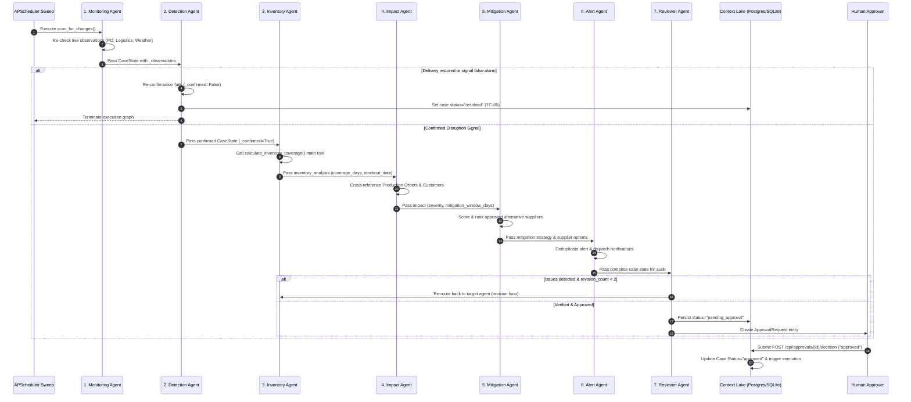
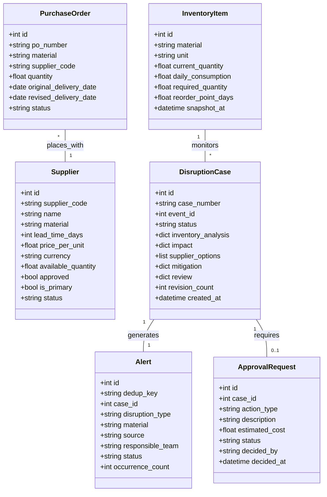
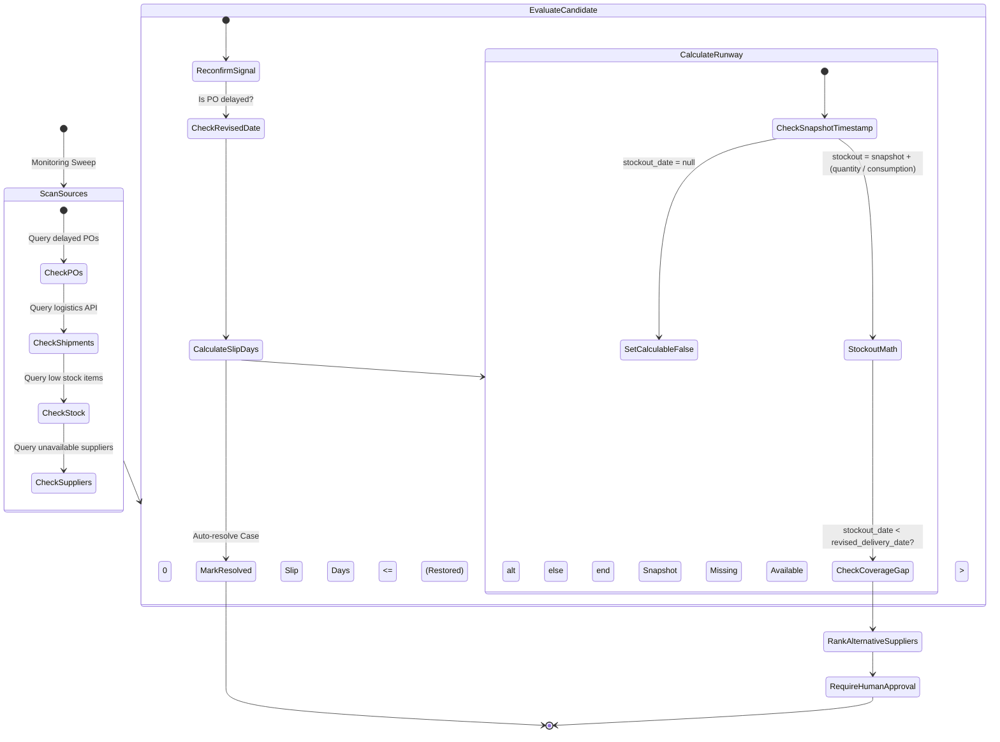
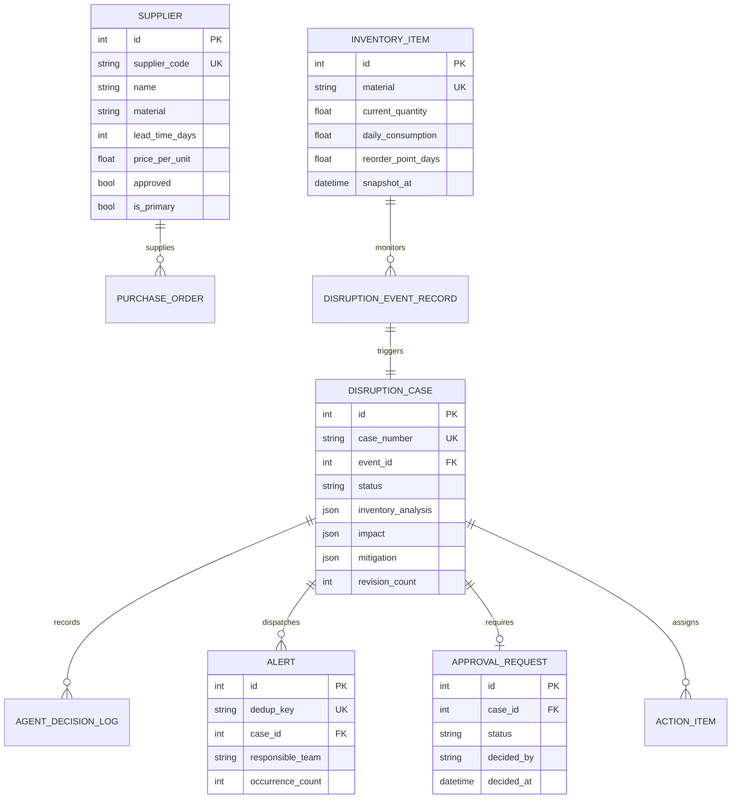

# System Architecture & Technical Specifications

This document provides a comprehensive technical blueprint of the **Agentic AI Supply Chain Disruption Monitoring System**, detailing service components, data flows, 7-agent LangGraph workflow orchestration, domain models, and system sequence diagrams using Mermaid UML format.

---

## 1. System Architecture Component Diagram (UML)

```mermaid
componentDiagram
    package "External Data Sources & Integrations" {
        [Supplier Status Feed] as SUP_FEED
        [Logistics Carrier API] as LOG_FEED
        [Inventory Snapshots] as INV_FEED
        [Open-Meteo Weather API] as WX_API
    }

    package "FastAPI Backend Service" {
        [APScheduler Daemon] as SCHED
        [REST API Router] as API_ROUTER
        [PDF Report Generator] as PDF_GEN
        
        package "LangGraph Agent Engine" {
            [1. Monitoring Agent] as AGENT_1
            [2. Detection Agent] as AGENT_2
            [3. Inventory & Demand Agent] as AGENT_3
            [4. Impact Assessment Agent] as AGENT_4
            [5. Mitigation Agent] as AGENT_5
            [6. Alert & Response Agent] as AGENT_6
            [7. Reviewer / Critic Agent] as AGENT_7
        }

        package "Deterministic Calculation Tools" {
            [Inventory Math Engine] as MATH_INV
            [Supplier Scoring Engine] as MATH_SUP
        }

        [SQLModel Engine] as ORM
    }

    database "Persistence Layer" {
        [(SQLite / PostgreSQL DB)] as DB
    }

    package "React Executive Dashboard" {
        [Control Center UI] as FE_UI
        [Disruption Simulator Widget] as SIM_UI
    }

    actor "Supply Chain Manager" as HUMAN

    %% Connectivity Relationships
    SUP_FEED --> SCHED
    LOG_FEED --> SCHED
    INV_FEED --> SCHED
    WX_API --> AGENT_1

    SCHED --> AGENT_1
    AGENT_1 --> AGENT_2
    AGENT_2 --> AGENT_3
    AGENT_3 --> AGENT_4
    AGENT_4 --> AGENT_5
    AGENT_5 --> AGENT_6
    AGENT_6 --> AGENT_7

    AGENT_3 ..> MATH_INV : Uses
    AGENT_5 ..> MATH_SUP : Uses
    AGENT_7 ..> MATH_INV : Re-verifies

    LangGraph Agent Engine <--> ORM
    ORM <--> DB
    API_ROUTER <--> ORM
    API_ROUTER --> PDF_GEN
    FE_UI <--> API_ROUTER
    SIM_UI --> API_ROUTER
    HUMAN <--> FE_UI
    API_ROUTER -. Approval Gate .-> HUMAN
```

---

## 2. 7-Agent LangGraph State Flow (Sequence Diagram)



---

## 3. Class Diagram for Domain Entities (UML)



---

## 4. Disruption Detection & Inventory Runway Activity Diagram (UML)



---

## 5. Database Entity Relationship Diagram (ERD)


